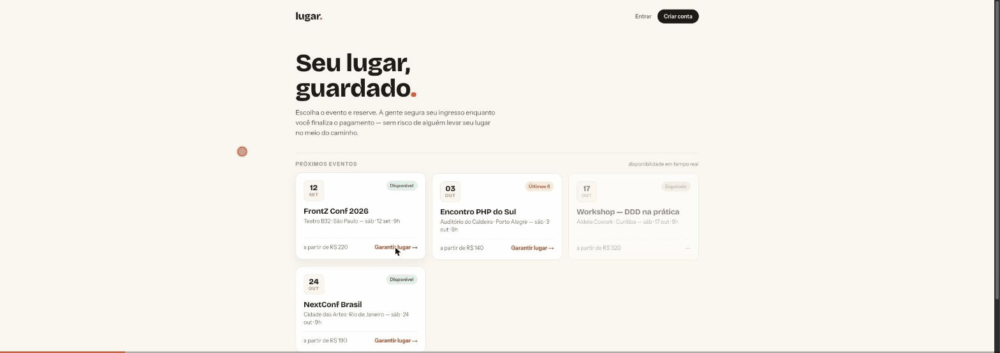
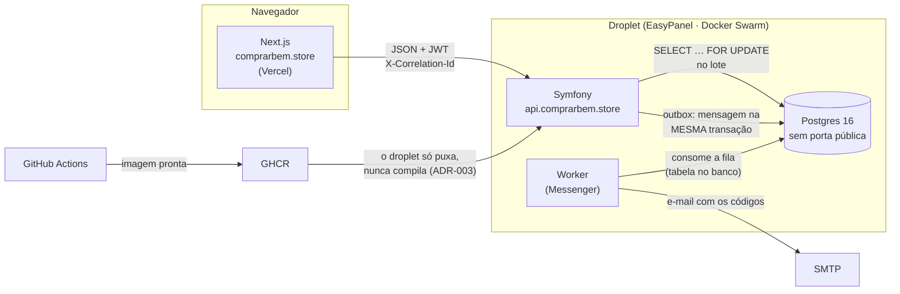

# lugar.

Plataforma de venda de ingressos com **reserva temporária**: o comprador garante o lugar por 10 minutos enquanto paga. Se pagar, vira venda. Se não, o ingresso volta para o estoque.

> **Estado:** funcional, no ar em **https://comprarbem.store**. Vitrine, reserva sob lock pessimista, pagamento com webhook idempotente, emissão de ingresso, painel do organizador, criação e publicação de evento, escala e validação na portaria — tudo de ponta a ponta, com 100 testes verdes. O que resta é infraestrutura de operação (backup testado, snapshot) — ver [ESTADO.md](ESTADO.md).



*O fluxo inteiro em produção, como convidado: lote → reserva com contador → pagamento → um QR por pessoa (RN-08).*

## O problema

Venda de ingresso é um problema de **estoque sob concorrência**. Dois usuários clicam em "comprar" no último ingresso no mesmo milissegundo. Sem tratamento, o banco aceita os dois e o evento tem 501 pessoas para 500 lugares.

A reserva temporária resolve isso de forma humana — e transforma o problema em um exercício de controle de concorrência, que é o que este repositório existe para demonstrar.

## Decisões que carregam o projeto

| ADR | Decisão | Por quê em uma linha |
| --- | ------- | -------------------- |
| [001](docs/adr/001-fronteira-do-agregado.md) | `Lote` guarda contadores; `Reserva` é agregado separado | Um agregado que cresce com o sucesso do evento é insustentável |
| [002](docs/adr/002-expiracao-preguicosa.md) | Expiração preguiçosa, sem cron | Um job de varredura cria uma janela em que o estoque existe mas o sistema não sabe |
| [003](docs/adr/003-front-vercel-api-easypanel.md) | Front na Vercel, API no EasyPanel, mesmo domínio | *Same-site* é o que permite cookie `httpOnly` sem depender de cookie de terceiros |
| [004](docs/adr/004-identidade-e-acesso.md) | Autorização por vínculo, não por papel | `ROLE_ORGANIZADOR` diz que pode organizar — não diz *quais* eventos |

Documentos completos: [PRD](PRD.md) (o quê e por quê), [PLAN](PLAN.md) (em que ordem e com qual critério de pronto) e [ESTADO](ESTADO.md) (onde paramos, o que está no ar, e as armadilhas já encontradas).

## Vendo funcionar

**https://comprarbem.store** — a demonstração no ar.

Entre com uma das contas em `/entrar` (senha `demonstracao123`):
`rafael@lugar.demo` (organizador), `portaria@lugar.demo`, `ana@lugar.demo`.

## Como as peças se encaixam



O caminho crítico é a seta do meio: toda reserva atravessa um `SELECT … FOR
UPDATE` na linha do lote, e a disponibilidade é recalculada **dentro** do lock
(ADR-001, ADR-002). O worker não tem fila externa: o transporte do Messenger é
uma tabela no mesmo banco, o que faz o despacho dentro da transação virar
outbox de graça.

## Stack

| Camada | Tecnologia |
| ------ | ---------- |
| Front | Next.js (App Router), TypeScript, Tailwind — na Vercel |
| API | PHP 8.4, Symfony 8.1, Doctrine ORM 3 — no EasyPanel |
| Banco | PostgreSQL 16, sem porta pública |
| Fila | Symfony Messenger |

O `Domain/` da API não importa `Symfony\` nem `Doctrine\`, e um teste de arquitetura quebra o CI se alguém tentar.

## Rodando

Tudo de uma vez — banco, API e worker:

```bash
docker compose up -d
curl http://localhost:8000/health
```

O front, separado:

```bash
cd apps/web && npm install && npm run dev
```

`http://localhost:3000/guia` lista todas as telas com a origem no design e o endpoint que cada uma vai consumir.

### Os três portões de qualidade

```bash
docker compose exec api composer check
```

Roda, nesta ordem: **camadas** (Deptrac), **tipos** (PHPStan nível 9) e **testes** (PHPUnit).

### O teste que importa

```bash
docker compose exec api vendor/bin/phpunit --testsuite integracao
```

`tests/Integracao/Reserva/ConcorrenciaTest.php` dispara 10 processos PHP
independentes, cada um com sua conexão, todos sincronizados para atacar a
mesma linha no mesmo instante — contra um lote com **um** lugar.

Exatamente um vence; nove recebem `estoque-insuficiente`.

Removendo o `LockMode::PESSIMISTIC_WRITE` do repositório, o mesmo teste
registra **cinco** vendas para um lugar. É o bug que o projeto existe para
impedir, e o teste o pega.

### O segundo teste que importa

`tests/Integracao/Organizador/PainelAutorizacaoTest.php` sobe o kernel HTTP
inteiro e prova que um organizador **autenticado, com token válido e o papel
correto**, recebe 403 ao pedir o painel do evento de outro. Papel diz que a
pessoa pode organizar; não diz *quais* eventos — quem responde isso é o
vínculo (`evento.organizador_id` e `evento_operador`).

É a falha de autorização mais comum que existe, e passa despercebida porque a
tela nunca oferece o link. A API não sabe o que a tela oferece.

O mesmo padrão se repete em toda a fase 6 e 7: publicar, excluir, exportar e
escalar têm caso negativo com token válido (`GestaoDeEventosTest`,
`EscalaDeOperadoresTest`), e a catraca tem o seu próprio teste de concorrência
— 8 leitores no mesmo código, exatamente 1 entra (`CatracaConcorrenteTest`).

### 90 segundos de tour

1. **O que o sistema faz:** este README até aqui.
2. **O teste de concorrência:** [`ConcorrenciaTest.php`](apps/api/tests/Integracao/Reserva/ConcorrenciaTest.php) — o arquivo se explica.
3. **Uma decisão de arquitetura:** [ADR-002](docs/adr/002-expiracao-preguicosa.md), duas páginas.
4. **Rodar tudo:** `docker compose up -d`, `docker compose exec api php bin/console lugar:popular`, `cd apps/web && npm install && npm run dev` — e entrar com `rafael@lugar.demo` / `demonstracao123`.

## Estado atual

**Pronto — as fases 0 a 7 do [PLAN.md](PLAN.md):**

- **Domínio puro** — `Lote`, `Reserva`, `Ingresso`, `Evento` e Value Objects, sem framework; Deptrac quebra o CI se `Domain/` importar `Symfony\` ou `Doctrine\`
- **Lock pessimista e os dois testes de concorrência** — 10 processos disputando 1 lugar na reserva; 8 leitores no mesmo ingresso na catraca. Exatamente 1 passa, nos dois
- Esquema com `CHECK (quantidade_vendida <= quantidade_total)`, `UNIQUE` nas chaves de idempotência e índice parcial na query mais quente
- **Identidade e autorização por vínculo** — Argon2id, JWT + refresh rotacionado em cookie `httpOnly`, `EventoVoter`/`PortariaVoter`, caso negativo testado em todo endpoint protegido
- **Comprador** — vitrine, reserva com `Idempotency-Key`, checkout com countdown derivado do servidor, os dois 409 distinguidos por `type` (RFC 7807)
- **Pagamento** — gateway por porta (adaptador de demonstração, sem chave), webhook HMAC verificado antes de qualquer processamento, idempotente por `UNIQUE` no banco, e-mail via outbox (`doctrine://` dentro da transação)
- **Organizador** — criar/publicar/cancelar/excluir evento (RN-11, RN-12), painel com conversão reserva→venda e taxa de expiração (PRD §6.5), compradores + CSV, escala da portaria
- **Portaria** — RN-10 com horário da primeira leitura em campo próprio do problem+json, recusa por evento errado, tela de leitura em tempo real
- **Observabilidade** — logs JSON em produção com `correlation_id` atravessando front → API → worker
- Deploy: imagem construída no CI → GHCR → EasyPanel; front na Vercel; migrations no boot sob `pg_advisory_lock`

**Falta — operação (fase 8 do PLAN):**

- `pg_dump` diário para DigitalOcean Spaces + um restore testado de verdade
- Snapshot semanal do droplet
- Rotação dos tokens listados em [ESTADO.md](ESTADO.md#pendências-de-segurança-do-dono-do-projeto)

A ordem de construção está em [PLAN.md §5](PLAN.md). O front foi feito fora de ordem, de propósito, e o [§2.1](PLAN.md) explica a decisão e o risco assumido.

## Sobre o `design/`

Referências hi-fi em HTML — aparência e comportamento pretendidos, **não** código de produção. Foram recriadas em Next.js e Tailwind; os arquivos originais ficam no repositório como fonte da verdade visual.

## Licença

MIT
